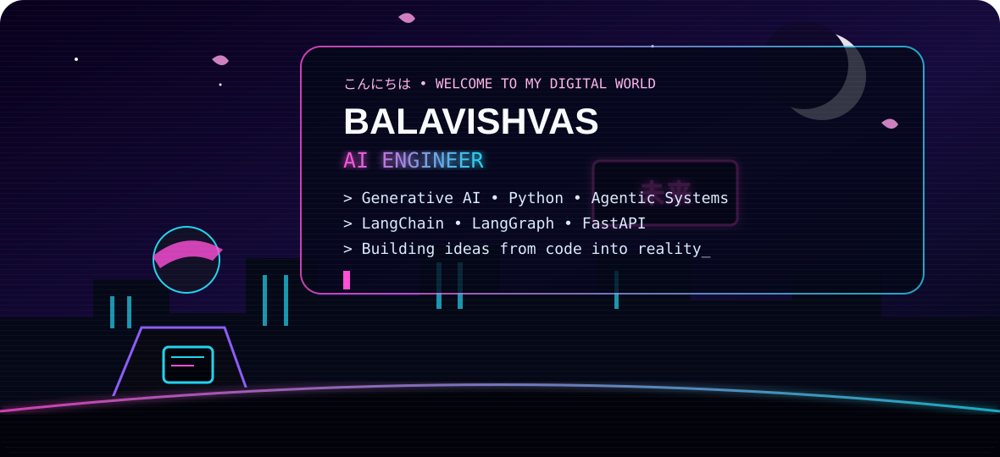
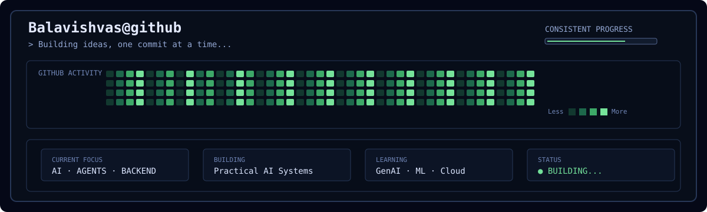

<div align="center">



<br/>

### 🌸 `AI • AGENTIC SYSTEMS • BACKEND`

[](https://www.linkedin.com/)
[](https://github.com/Balavishvas)

</div>

---

## 🌸 01 — `こんにちは / ABOUT ME`

```text
> AI & Data Science student
> Building practical AI-powered applications
> Exploring Generative AI, Agentic AI & backend systems
> Turning ideas into useful products, one commit at a time.
```

## ⚡ 02 — `MY ARSENAL`

<div align="center">

**Languages**

`Python` `SQL` `Java`

**AI / ML**

`Generative AI` `Machine Learning` `TensorFlow`
`LangChain` `LangGraph`

**Backend / Tools**

`FastAPI` `Node.js` `MongoDB` `Docker` `Git` `GitHub`

</div>

---

## 🚀 03 — `FEATURED MISSIONS`

### 🤖 Mission 01 — Deep Research Agent
AI-powered research system designed to gather, analyze and synthesize information.

**Focus:** `Generative AI` · `Agents` · `Research`

### 🛡️ Mission 02 — TourChain
AI-powered tourist safety monitoring system.

**Focus:** `AI` · `Safety` · `Intelligent Systems`

### 🎙️ Mission 03 — Effy AI Voice Agent
Real-time AI voice assistant focused on natural interaction.

**Focus:** `Voice AI` · `Agents` · `Backend`

### 🔎 Mission 04 — GitHub Profile Inspector
Small Python CLI that reads a public GitHub profile and displays useful profile statistics through the GitHub REST API.

**Focus:** `Python` · `REST API` · `CLI`

---

## 📚 04 — `RESEARCH LOG`

**Deep Research Agent — IEEE Conference Paper**

A research-oriented project exploring AI agents for automated research and information synthesis.

---

## 📊 05 — `GITHUB JOURNEY`

<div align="center">



</div>

---

## 🌙 `CURRENTLY`

```text
[■■■■■■■■■■■■■■░░░] Building AI systems...
[■■■■■■■■■■░░░░░░░░] Learning every day...
[■■■■■■■■■■■■■■■■░] Creating the next project...
```

---

<div align="center">

### 🌸 `未来へ — TO THE FUTURE`

> *Keep building. Keep learning. Keep creating.*

**またね 👋**

</div>
