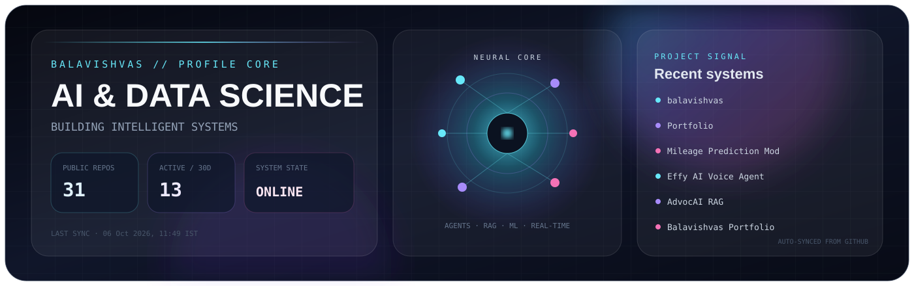

<div align="center">



### AI & Data Science · Agentic AI · Backend Systems

<a href="https://github.com/Balavishvas"></a>
<a href="https://www.linkedin.com/"></a>

</div>

---

## 👋 About

I'm **Balavishvas**, a B.Tech student specializing in **Artificial Intelligence & Data Science**.

I enjoy turning ideas into working systems — from AI agents and RAG pipelines to real-time applications and developer tools.

```text
Focus → AI systems · Agentic workflows · RAG · Backend · Real-time apps
Build  → practical tools, experiments, and end-to-end products
Learn  → by building, testing, breaking, and improving
```

---

## ⚡ Tech Stack

| Area | Technologies |
|---|---|
| **Languages** | Python · Java · JavaScript · SQL |
| **AI / ML** | TensorFlow · Machine Learning · Generative AI · NLP |
| **Agents / RAG** | LangGraph · RAG · LLM applications · Vector search |
| **Backend** | FastAPI · Node.js · Express · REST APIs · WebSockets |
| **Data** | MongoDB · MySQL · Pandas · NumPy |
| **Frontend** | React · JavaScript · HTML · CSS · Tailwind |
| **DevOps / Tools** | Docker · Git · GitHub · Postman · Linux |

---

## 🚀 Featured Projects

| Project | What it does | Stack | Status |
|---|---|---|---|
| **[WhatIf-AI](https://github.com/Balavishvas/WhatIf-AI)** | Scenario generation and outcome simulation system | AI · Agents · Simulation | 🟢 Building |
| **[InferRAG](https://github.com/Balavishvas/InferRAG)** | RAG system evolving toward multi-format document intelligence | Python · RAG · LLM | 🟢 Building |
| **[TourChain](https://github.com/Balavishvas/Touriest-Safety-Monitoring-And-Incident-Response-System)** | Real-time tourist safety and incident-response platform | Node.js · FastAPI · AI · WebSockets | 🟡 Developing |
| **[Effy AI](https://github.com/Balavishvas/Effy-AI-Voice-Agent)** | Real-time AI voice assistant | Python · LiveKit · WebRTC | 🟡 Developing |
| **[API Inspector](https://github.com/Balavishvas/api-inspector)** | Developer tool for understanding and testing APIs | Python · HTTP · APIs | 🟢 Active |
| **[DeepResearchAgent](https://github.com/Balavishvas/DeepResearchAgent)** | Agentic research workflow for gathering and synthesizing information | Python · Agents · LLM | 🟡 Exploring |
| **[CodeLens](https://github.com/Balavishvas/CodeLens)** | Developer-focused code analysis experiment | AI · Developer Tools | 🟡 Exploring |

---

## 🧠 What I'm Building Around

```text
                 ┌───────────────┐
                 │   AI SYSTEMS  │
                 └───────┬───────┘
                         │
        ┌────────────────┼────────────────┐
        ▼                ▼                ▼
      AGENTS            RAG           SIMULATION
        │                │                │
        └────────────────┼────────────────┘
                         ▼
                  USEFUL SOFTWARE
```

- **Agentic AI** — multi-step reasoning and tool-based workflows
- **RAG** — retrieval, evidence, evaluation, and multi-format knowledge systems
- **AI simulation** — decisions, events, scenarios, and possible outcomes
- **Developer tooling** — tools that make engineering workflows easier
- **Real-time systems** — WebSockets, streaming, voice, and event-driven applications

---

## 📈 GitHub

<div align="center">


</div>

---

## 🧪 Current Build Queue

| Priority | System | Direction |
|---|---|---|
| `01` | **WhatIf-AI** | Decision extraction → state modeling → scenario generation → simulation |
| `02` | **InferRAG** | Documents → images → Word → PPT → evidence → evaluation |
| `03` | **Developer Tools** | Small utilities that solve real engineering problems |
| `04` | **AI Experiments** | New models, agents, workflows, and prototypes |

---

## 🌐 Connect

<div align="center">

**Build → Learn → Experiment → Repeat**

<a href="https://github.com/Balavishvas">GitHub</a> ·
<a href="https://www.linkedin.com/">LinkedIn</a>

<br/><br/>

<sub>Profile banner automatically changes its visual mode throughout the day (IST).</sub>

</div>
